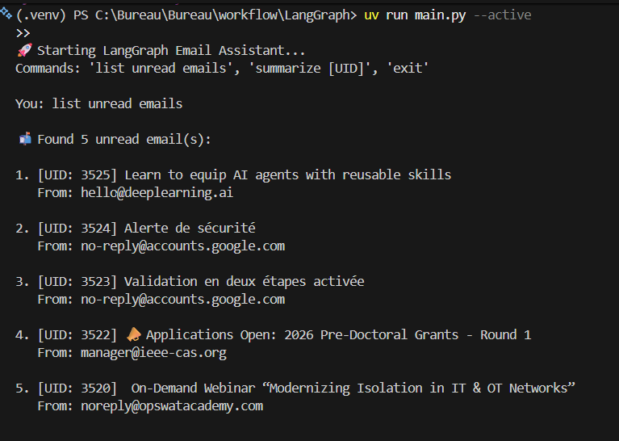
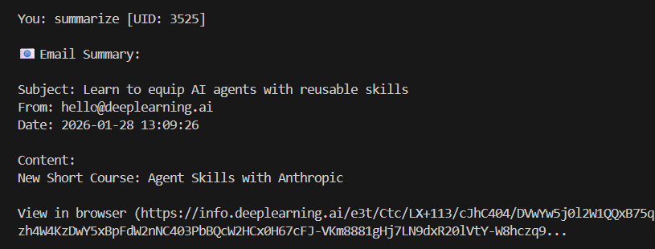

# LangGraph Email Assistant

Small CLI assistant for IMAP inbox workflows using LangGraph.

## Features

- List unread emails (UID, subject, sender)
- Summarize a specific email by UID
- Simple command loop in terminal

## Requirements

- Python 3.10+
- IMAP account access (for Gmail, use an app password)

Install dependencies:

```bash
pip install -r requirements.txt
```

## Configuration

Create a `.env` file in `/home/runner/work/langchain_init/langchain_init/LangGraph`:

```env
IMAP_HOST=imap.gmail.com
IMAP_USER=your_email@example.com
IMAP_PASSWORD=your_app_password
```

Used by `main.py`:
- `IMAP_HOST`
- `IMAP_USER`
- `IMAP_PASSWORD`

## Run

```bash
python main.py
```

## Supported commands

- `list unread emails`
- `summarize <UID>`
- `exit`

Example:

```text
You: list unread emails
You: summarize 12345
You: exit
```

## Troubleshooting

- **Authentication failed**: verify IMAP is enabled and app password is correct.
- **No unread messages shown**: check the configured folder (`INBOX`) and mailbox state.
- **Connection errors**: confirm host, network access, and credentials in `.env`.

## Screenshots



